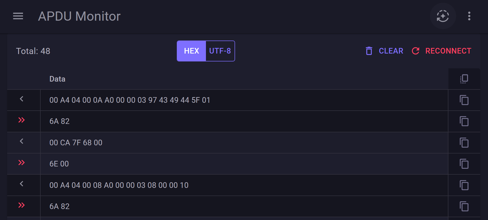

# ApduWebMonitor

## What this project is

ApduWebMonitor is a small ASP.NET Core interactive Blazor application for monitoring APDU (smart-card) traffic. It hosts a background ETW listener that receives APDU events and displays parsed APDU commands and responses in a web UI. The UI uses Blazor Interactive Server with MudBlazor components.

Key responsibilities:
- Listen for APDU events from an ETW session and parse them into APDU command/response objects.
- Maintain an in-memory store of APDU exchanges for display in the UI.
- Provide utilities for formatting APDU data into readable and hex representations.

## Important prerequisite

Windows OS required. This project extends an already existing app [APDUTrace](https://www.mysmartlogon.com/knowledge-base/trace-apdu-on-windows/). You should start it before running ApduWebMonitor. APDUTrace is needed to create the ETW session and smart-card driver service.

Notes:
- APDUTrace is not included in this repository.
- ApduWebMonitor should be started with admin rights (for ETW and pnputil).
- The ETW session name is configurable in `appsettings.json` (either `APDUTrace` or `APDUTraceLive`).

## How it works (quick)

1. APDUTrace emits ETW events into an ETW session.
2. `EtwDataLoader` (a hosted background service) attaches to that session and receives events.
3. APDU strings are parsed into byte arrays, then converted to PC/SC `CommandApdu` and `ResponseApdu` objects and stored in `ApduStore`.
4. The Blazor UI reads from `ApduStore` and displays the exchanged APDUs in a web interface.

## Contributing / Next steps

- Send custom APDU commands
- Describe meanngful bytes according to ISO/IEC 7816-4
- ...